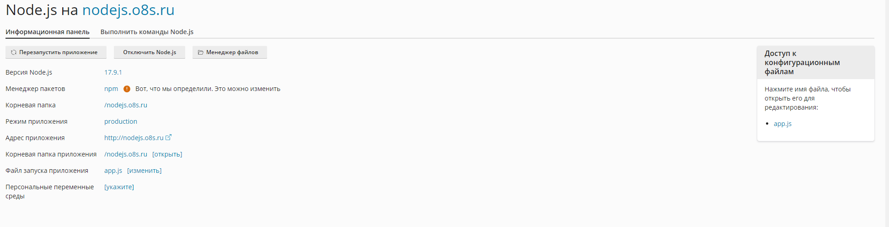

# EasyNodeJS

Данный проект показывает простейшее приложение NodeJS, которое можно развернуть на Plesk.

# как должно быть настроено в панели пример созданный домен(nodejs.o8s.ru)



## Почему НЕ следует использовать фиксированный порт и хост

Обычно, когда вы создаете простое Node.js приложение, вы можете видеть следующий код:

```javascript
const http = require('http');
const hostname = '127.0.0.1';
const port = 3000;

const server = http.createServer((req, res) => {
    res.statusCode = 200;
    res.setHeader('Content-Type', 'text/plain');
    res.end('Hello World\n');
});

server.listen(port, hostname, () => {
    console.log(`Server running at http://${hostname}:${port}/`);
});
```

### Почему этот код не подходит для Plesk

1. **Порт 3000 может быть недоступен:** В большинстве случаев Plesk не предоставляет доступ к нестандартным портам, таким как 3000. Порт 80 для HTTP и порт 443 для HTTPS обычно зарезервированы для веб-сервера (Apache или Nginx), который используется для обработки запросов.

2. **Хост 127.0.0.1 ограничивает доступ:** Привязка сервера к 127.0.0.1 означает, что сервер будет доступен только локально. Это может создать проблемы при доступе к приложению извне через ваш домен.

## Корректный способ запуска Node.js приложения на Plesk

Для работы в Plesk необходимо использовать следующую конфигурацию:

```javascript
const http = require('http');

// Сервер будет прослушивать все доступные IP-адреса и порты, назначенные Plesk.
const server = http.createServer((req, res) => {
    res.statusCode = 200;
    res.setHeader('Content-Type', 'text/plain');
    res.end('Hello World\n');
});

server.listen(); // Убираем указание порта, чтобы использовать стандартный.
```

### Преимущества данного подхода

1. **Использование стандартных портов:** Plesk перенаправляет HTTP и HTTPS запросы через стандартные порты (80 и 443). Убирая фиксированный порт в коде, мы позволяем Plesk управлять этим процессом, что делает приложение доступным по стандартному URL.

2. **Универсальность:** Приложение будет работать на всех доступных IP-адресах и портах, предоставленных сервером. Это делает его более гибким и пригодным для использования в различных окружениях.

3. **Автоматическая настройка через Plesk:** Plesk сам управляет прокси-сервером, перенаправляя запросы на ваше Node.js приложение, что упрощает процесс развертывания и настройки.

## Заключение

При работе с Plesk важно учитывать особенности среды, чтобы обеспечить корректную работу вашего Node.js приложения. Следуя данному руководству, вы сможете успешно развернуть свое приложение и сделать его доступным через ваш домен.
